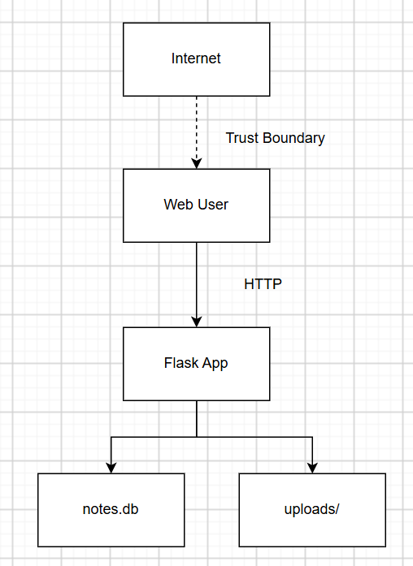

# Threat Model — <app name>

## 1. Data-flow diagram

## 2. Elements & trust boundaries
| Element | Type (process/store/entity/flow) | Trust boundary crossed? |
|---|---|---|
| Web client | external entity | yes (Internet → app) |
| Flask app | process | |
| SQLite DB (`notes.db`) | data store | |
| `uploads/` store | data store | |

## 3. STRIDE analysis
| Element | S | T | R | I | D | E |
|---|---|---|---|---|---|---|
| /notes | Client can claim any owner; no authentication | — | No request logging | — | — | — |
| /upload | — | Client-controlled filename allows arbitrary file write/path traversal | No request logging | Save path is disclosed in response | No file size/rate limit | — |
| /files/<name> | — | — | No request logging | — | — | — |

## 4. Top 5 risks (likelihood × impact) + mitigation
1. SQL injection in /login and /search — Likelihood: High, Impact: High. Mitigation: use parameterized queries and bind all user input as data.
2. Arbitrary file write / path traversal in /upload — Likelihood: High, Impact: High. Mitigation: validate filenames with secure_filename(), restrict extensions, and store uploads outside the web root.
3. Information disclosure from /upload echoing the resolved path — Likelihood: Medium, Impact: Medium. Mitigation: do not return internal file paths; return a safe identifier or redirect instead.
4. Missing authentication / authorization on protected actions — Likelihood: Medium, Impact: High. Mitigation: require valid session checks and enforce role/ownership checks on all protected routes.
5. Denial of service via oversized or repeated uploads — Likelihood: Medium, Impact: Medium. Mitigation: enforce upload size limits, rate limiting, and resource quotas.
