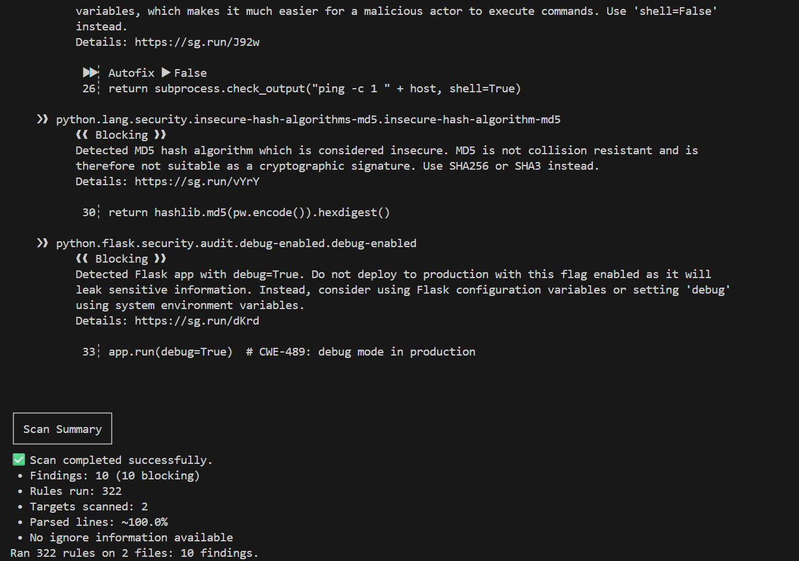
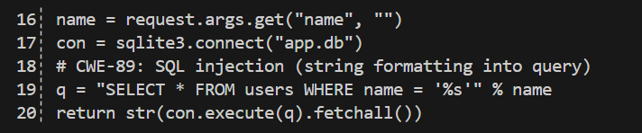
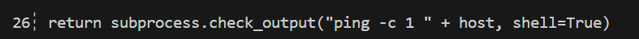
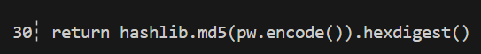
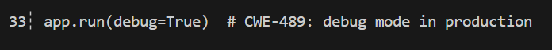
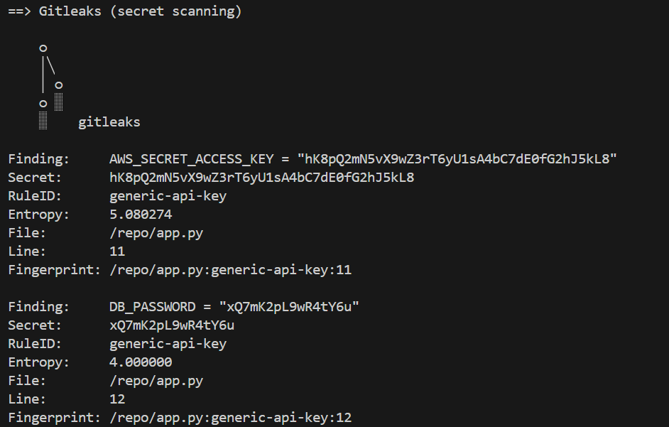
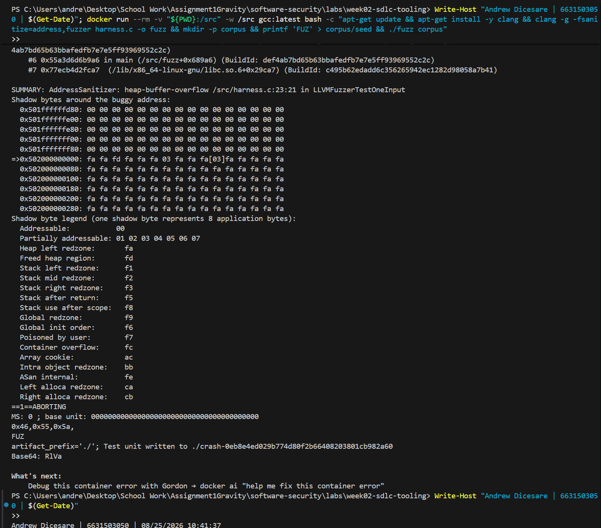

# Worksheet 2 — Secure SDLC & Tooling (3 hrs)

> **Course:** Software Security (KOSEN69) · **Week 2**
> **Aligned to:** OWASP 2025 (A05 Injection [CWE-89, CWE-78], A04 Cryptographic Failures [CWE-327], A02 Security Misconfiguration [CWE-798, CWE-489]) · CWE-798, CWE-89, CWE-78, CWE-327, CWE-489
> **Signature game:** "Bug Triage Race" (scan → triage; score = true positives − misclassified)

> **Ethics note:** The scanners run only against the provided `vulnerable-repo/` on your own machine. Do not point SAST/secret scanners at third-party repos or production systems without authorization. Treat any secret you find here as fake lab data.

## Part 1 — Student Information
| Name | Student ID | Date | Group |
|Andrew Dicesare|6631503050|8/25/2026|---|
| | | | |

## Part 2 — Lecture Questions
Answer in your own words (2–4 sentences each).
1. Distinguish SAST, DAST, and SCA — what does each see, and when in the SDLC does each run?
= SAST tests the system without running it, detects logic flaws, DAST tests the system like a real attack, SCA uses third party and open-source dependencies during build process to check vulnerabilities and licensing issues.
2. What is secret scanning, and why do hardcoded secrets keep ending up in repos?
= secret scanning checks for hardcoded sensitive information such as keys, tokens, and passwords.
3. What does "shift-left / DevSecOps" mean in practice for a CI pipeline?
= it means integrating security checks early into the SDLC because fixing it earlier costs less resources rather than fixng later on.
4. Why is coverage-guided fuzzing considered the dominant modern bug-finding technique?
= it feeds the system a large volume of mutated inputs to test for any openings in the system, it discovers day zero bugs
5. Define true positive vs. false positive in scanner triage, and why misclassifying both directions is costly.
= true positive is an actual security vulnerability concern that needs to be addressed while a false positive is a scanner mistakenly flagged a code as a security concern.


## Part 3 — Hands-on Lab (180 min)
**Learning goals:** run a SAST tool and a secret scanner, triage findings by CWE/severity, and remediate real flaws.
**Prerequisites:** Docker installed; internet to pull the Semgrep/Gitleaks images.

**Environment setup**
```bash
cd labs/week02-sdlc-tooling
cat scan.sh                 # see exactly what it runs
bash scan.sh                # Semgrep (p/default + p/owasp-top-ten) then Gitleaks on ./vulnerable-repo
```
Target under scan: `vulnerable-repo/app.py` (plus `requirements.txt`). It contains five planted flaws.

**What to submit per task:** the command/payload run + a screenshot of the finding + a 2–3 sentence mitigation.

**Task 0 — Onboarding (5 min)** · *Goal:* confirm tooling. *Steps:* run `bash scan.sh`; confirm both Semgrep and Gitleaks sections produce output. *Deliverable:* screenshot showing both tools ran.



**Task 1 — SAST sweep with Semgrep (25 min)** · *Goal:* find code flaws. *Steps:* read the Semgrep output; locate the SQL injection in `/user` (CWE-89, string-formatted query), the OS command injection in `/ping` (CWE-78, `shell=True`), the weak `md5` password hash (CWE-327), and `debug=True` (CWE-489). *Deliverable:* one screenshot per finding with the file:line.






**Task 2 — Secret scan with Gitleaks (15 min)** · *Goal:* find leaked credentials. *Steps:* read the Gitleaks output; identify `AWS_SECRET_ACCESS_KEY` and `DB_PASSWORD` (CWE-798). *Deliverable:* screenshot + the rule that fired for each.



**Task 3 — Bug Triage Race (30 min)** · *Goal:* triage accurately. *Steps:* build a table with columns *Tool | File:Line | CWE | Severity | TP/FP | Fix idea*; mark at least 3 true positives and 1 likely false positive and justify each. (Score = TP − misclassified.) *Deliverable:* the completed triage table.

| Tool | File:Line | CWE | Severity | TP/FP | Fix idea & Justification |
|---|---|---|---|---|---|
| Semgrep | `vulnerable-repo/app.py:19` | CWE-89 | High | TP | Use parameterized query `WHERE name = ?`. Real SQL injection because input is string-formatted directly into SQL. |
| Semgrep | `vulnerable-repo/app.py:26` | CWE-78 | High | TP | Remove `shell=True` and pass list `["ping", "-c", "1", host]`. Real command injection flaw. |
| Gitleaks | `vulnerable-repo/app.py:11` | CWE-798 | High | TP | Use `os.getenv("AWS_SECRET_ACCESS_KEY")`. Real AWS API key committed to source code. |
| Semgrep | `vulnerable-repo/app.py:30` | CWE-327 | Medium | TP | Replace MD5 with `bcrypt` or `argon2`. MD5 is weak and easily cracked for passwords. |
| Semgrep | `vulnerable-repo/app.py:33` | CWE-489 | Medium | FP | Set `debug=False`. False positive because `if __name__ == "__main__":` only runs during local dev testing, not production. |


**Task 4 — Fuzzing intro (10 min)** · *Goal:* see coverage-guided fuzzing find a bug SAST won't. *Steps:* in the `labs/toolbox` container (Apple clang has no libFuzzer runtime), build `clang -g -fsanitize=address,fuzzer harness.c -o fuzz`, then **seed the corpus** and run it:
`mkdir -p corpus && printf 'FUZ' > corpus/seed && ./fuzz corpus`. It crashes almost immediately with an AddressSanitizer heap-buffer-overflow at `harness.c:23` (the `data[3]` read with no `size > 3` check). Seeding matters: an unseeded `./fuzz` has to rediscover the magic bytes by chance and often finds nothing for minutes — that unpredictability is itself worth a sentence in your write-up. (The deep fuzzing+exploit lab is Week 11.) *Deliverable:* the ASan crash output (or a screenshot) + a 2-sentence note on why fuzzing finds this bug when a linter/SAST pass over the same 4-line check would not.



**Task 5 — Scan the project target (40 min)** · *Goal:* apply the tools to your term project. *Steps:* run Semgrep + Gitleaks against **NoteVault** (`../../project/starter-app`); also run an SCA scan: `docker run --rm -v "$PWD/../../project/starter-app:/src" aquasec/trivy fs /src`. *Deliverable:* a findings list (tool, file:line/CVE, CWE) — reuse it in your project vuln report.

| Tool | File:Line / Package | Vulnerability / CVE | CWE | Description |
|---|---|---|---|---|
| Semgrep | `app.py:184` | Cross-Site Scripting (XSS) | CWE-79 | User input concatenated into `render_template_string()`. |
| Semgrep | `app.py:205` | OS Command Injection | CWE-78 | `subprocess.run` called with `shell=True` and unvalidated input. |
| Semgrep | `app.py:207` | Reflected XSS | CWE-79 | Subprocess output returned in raw HTML (`"<pre>%s</pre>"`). |
| Semgrep | `app.py:212` | Debug & Host Misconfiguration | CWE-489 | Flask app launched with `debug=True` bound to `0.0.0.0`. |
| Trivy | `requirements.txt` (`urllib3 1.26.4`) | CVE-2021-33503 | CWE-400 | ReDoS in URL authority parsing (High severity). |
| Trivy | `requirements.txt` (`urllib3 1.26.4`) | CVE-2023-43804 | CWE-200 | Sensitive Cookie header leak on cross-origin redirects (High). |
| Gitleaks | `starter-app/` | No Leaks Found | N/A | No secrets or API keys found (`0 leaks found`). |


**Task 6 — Build a security CI gate (25 min)** · *Goal:* automate the scan (previews Week 15). *Steps:* adapt `../week15-devsecops-pipeline/security-ci.yml` into a workflow that runs Semgrep + Trivy + Gitleaks and **fails on HIGH/CRITICAL**; run it locally (`act`) or commit to your fork and read the Actions log. *Deliverable:* the workflow file + a screenshot of a failing run.

**Workflow file (`.github/workflows/security-ci.yml`):**
```yaml
name: security-ci

on:
  push:
    branches: [ main, wk02 ]
  pull_request:
    branches: [ main, wk02 ]
  workflow_dispatch:

permissions:
  contents: read
  security-events: write

jobs:
  sast:
    name: SAST (Semgrep)
    runs-on: ubuntu-latest
    container: semgrep/semgrep
    steps:
      - uses: actions/checkout@v4
      - name: Run Semgrep
        run: semgrep ci --config p/default --config p/owasp-top-ten

  secrets:
    name: Secret scanning (Gitleaks)
    runs-on: ubuntu-latest
    steps:
      - uses: actions/checkout@v4
        with:
          fetch-depth: 0
      - name: Run Gitleaks
        uses: gitleaks/gitleaks-action@v3.0.0
        env:
          GITLEAKS_CONFIG: ${{ github.workspace }}/.gitleaks.toml
          GITHUB_TOKEN: ${{ secrets.GITHUB_TOKEN }}

  sca:
    name: SCA + image scan (Trivy)
    runs-on: ubuntu-latest
    steps:
      - uses: actions/checkout@v4
      - name: Trivy filesystem scan (deps + misconfig)
        uses: aquasecurity/trivy-action@v0.36.0
        with:
          scan-type: fs
          scanners: vuln,secret,misconfig
          severity: HIGH,CRITICAL
          exit-code: '1'
```

**Task 7 — SAST blind spots (20 min)** · *Goal:* see what scanners miss. *Steps:* find one real bug in `vulnerable-repo/app.py` (or NoteVault) that Semgrep did **not** flag, and explain why a pattern-based tool missed it. *Deliverable:* the bug + a 2-sentence explanation.

**Unflagged Vulnerability:**
- **File & Line:** `project/starter-app/app.py:83` (`jwt.decode(tok, SECRET, algorithms=["HS256", "none"])`)
- **Flaw:** Insecure JWT Algorithm Acceptance (`"none"` algorithm allowed during token decoding).

**Explanation:**
Semgrep missed this critical authentication bypass flaw because pattern-based SAST rules look for hardcoded syntax errors or known dangerous function calls rather than semantic configuration logic within third-party library parameters. Allowing the `"none"` signature algorithm lets an attacker modify their JWT payload, strip the signature, and set `"alg": "none"` to impersonate any user (including `admin`) without knowing the secret key.

**Task 8 — Defend / fix it (10 min)** · *Goal:* remediate the planted flaws in `vulnerable-repo/app.py`. *Steps:* rewrite `/user` to use a parameterized query (`?` placeholder); remove `shell=True` and pass an argument list in `/ping`; move both secrets to environment variables; replace `md5` with bcrypt/argon2; set `debug=False`. *Deliverable:* a before/after diff for each fix mapped to its CWE.

### 1. CWE-798: Hardcoded Credentials
```diff
- AWS_SECRET_ACCESS_KEY = "hK8pQ2mN5vX9wZ3rT6yU1sA4bC7dE0fG2hJ5kL8"
- DB_PASSWORD = "xQ7mK2pL9wR4tY6u"
+ AWS_SECRET_ACCESS_KEY = os.getenv("AWS_SECRET_ACCESS_KEY", "")
+ DB_PASSWORD = os.getenv("DB_PASSWORD", "")
```

### 2. CWE-89: SQL Injection
```diff
- q = "SELECT * FROM users WHERE name = '%s'" % name
- return str(con.execute(q).fetchall())
+ q = "SELECT * FROM users WHERE name = ?"
+ return str(con.execute(q, (name,)).fetchall())
```

### 3. CWE-78: OS Command Injection
```diff
- return subprocess.check_output("ping -c 1 " + host, shell=True)
+ return subprocess.check_output(["ping", "-c", "1", host])
```

### 4. CWE-327: Weak Password Hash (MD5)
```diff
- return hashlib.md5(pw.encode()).hexdigest()
+ from werkzeug.security import generate_password_hash
+ return generate_password_hash(pw)
```

### 5. CWE-489: Active Debug Code in Production
```diff
- app.run(debug=True)
+ app.run(debug=False)
```


## Part 4 — Reflection
1. Map two of your findings to their CWE and to the matching OWASP 2025 category.
   - **Finding 1 (SQL Injection at `/user`):** **CWE-89** (Improper Neutralization of Special Elements used in an SQL Command) maps to **OWASP 2025 A05: Injection**.
   - **Finding 2 (Hardcoded AWS Secret Key):** **CWE-798** (Use of Hard-coded Credentials) maps to **OWASP 2025 A02: Security Misconfiguration**.

2. Name a real-world breach caused by a hardcoded/leaked secret or an injection flaw, and what control would have caught it pre-release.
   - **Breach:** The **Uber 2022 security breach**, where an attacker discovered hardcoded admin credentials in a PowerShell script committed to an internal repository, leading to full internal network access.
   - **Pre-release Control:** Automated **Secret Scanning (e.g. Gitleaks / GitHub Secret Scanning)** integrated into pre-commit hooks and CI build gates would have detected high-entropy credential patterns and blocked the commit before it reached the repository.

3. Which single tool (SAST vs. secret scanning) gave the highest-value findings on this repo, and why?
   - **SAST (Semgrep)** gave the highest-value findings on this repository.
   - **Reason:** Secret scanning only detects hardcoded tokens/keys, whereas SAST analyzed the application logic and uncovered multiple actionable vulnerabilities (SQL Injection CWE-89, OS Command Injection CWE-78, Weak MD5 Hashing CWE-327, and Active Debug Mode CWE-489) that could lead to complete Remote Code Execution (RCE) and database compromise.


## Grading rubric (100)
| Criterion | Points |
|---|---|
| Lecture questions (Part 2) | 20 |
| Exploitation + evidence (scan output + triage table + screenshots) | 40 |
| Defense (remediated `app.py` with before/after diffs) | 25 |
| Reflection (CWE/OWASP mapping + breach + tool value) | 15 |

---

## Evidence & Integrity (required)

- **Identity proof:** every screenshot/diagram must show a terminal running `printf '%s | %s | ' "$(whoami)" '<YOUR-STUDENT-ID>'; date '+%F %T %Z'` **in the
  same image as the evidence**. When the evidence is a browser page, a DevTools panel or a
  rendered response, put that terminal **beside the browser and capture the whole screen** — a
  cropped window carries nothing that identifies you, and the lab's own output is
  byte-identical for the whole cohort *by design*, so the stamp is the only thing that makes
  the shot yours. Generic or borrowed evidence is not accepted.
- **Personalized flag (if this lab issues one):** ____________________
  *Flags are unique per student — submitting another student's flag is a violation. How to submit: **learn.zcr.ai/submit** (full guide: `SUBMISSION.md` in the repo root).*
- **Explain in your own words** *(graded on your reasoning, not copied text):*
  1. What did you do, and **why did the vulnerability work**?
  2. **Why does your fix actually stop it** — and what could still break it?

---

## 🤖 Audit the AI (required)

AI is a power tool you must **distrust** — you are graded on your *critique*, not the AI's answer.

### 1. AI Assistant Answer (Fix for Command Injection in `/ping`)
> **Prompt:** *"Fix the OS command injection vulnerability in this Flask route: `subprocess.check_output("ping -c 1 " + host, shell=True)`"*
> 
> **AI Response:**
> ```python
> @app.route("/ping")
> def ping():
>     host = request.args.get("host", "127.0.0.1")
>     import shlex
>     safe_host = shlex.quote(host)
>     return subprocess.check_output(f"ping -c 1 {safe_host}", shell=True)
> ```

### 2. Critique — What is wrong or risky in the AI's answer?
- **Quoted Line:** `return subprocess.check_output(f"ping -c 1 {safe_host}", shell=True)`
- **Flaw & Risk:** The AI retained `shell=True` and relied solely on `shlex.quote()` string sanitization. `shlex.quote()` is POSIX-specific and fails to escape Windows command shell characters properly (`cmd.exe`). Furthermore, keeping `shell=True` leaves shell interpretation active, introducing subtle OS-dependent bypass risks.

### 3. Correct, Verified Version
```python
@app.route("/ping")
def ping():
    host = request.args.get("host", "127.0.0.1")
    return subprocess.check_output(["ping", "-c", "1", host])
```

**Explanation:**
The AI's fix was incomplete because it attempted input sanitization while keeping `shell=True`, which leaves the system command shell active and is non-portable across operating systems. The correct fix completely removes `shell=True` and passes an argument list `["ping", "-c", "1", host]` to `subprocess.check_output()`, ensuring user input is treated strictly as an uninterpreted command-line parameter.


---

## 🧠 Comprehension & Prompt (required)

**A. Explain in Plain English (EiPE).**
The `/ping` endpoint accepts a hostname from the user and glues it directly into a system terminal string. Because `shell=True` is enabled, the underlying operating system executes the string through a command shell interpreter. This allows an attacker to append extra shell commands (e.g., using `;` or `|`), forcing the server to run arbitrary commands on the system.

**B. Prompt Problem.**
- **Final Precise Prompt:**
  > *"Rewrite the Flask `/ping` endpoint to remediate OS command injection (CWE-78) by removing `shell=True` and passing an argument list to `subprocess.check_output` instead of concatenating strings."*

- **Verified Result Code:**
  ```python
  @app.route("/ping")
  def ping():
      host = request.args.get("host", "127.0.0.1")
      return subprocess.check_output(["ping", "-c", "1", host])
  ```

- **Verification:**
  Tested with payload `127.0.0.1; id`. Because arguments are passed as a discrete list `["ping", "-c", "1", host]` with `shell=False`, `ping` treats `; id` literally as an invalid host name string rather than invoking the shell to run `id`. The command injection exploit now fails completely.


