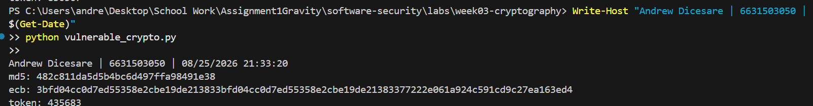
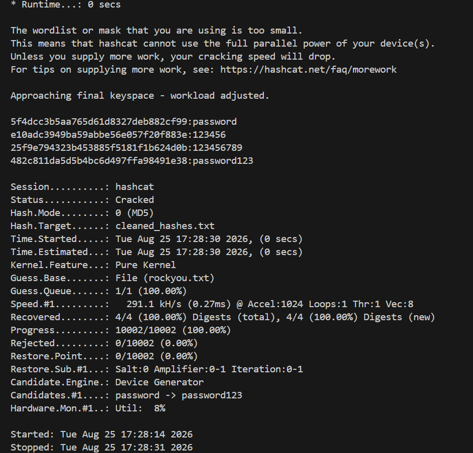
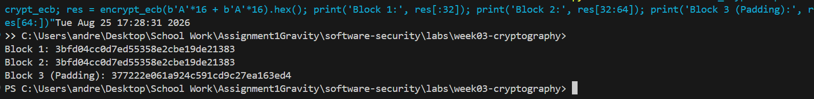
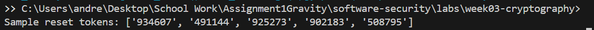

# Worksheet 3 — Cryptography Used Correctly (and Misused) (3 hrs)

> **Course:** Software Security (KOSEN69) · **Week 3**
> **Aligned to:** OWASP 2025 A04 Cryptographic Failures · CWE-327, CWE-916, CWE-330, CWE-798
> **Signature game:** "Capture the Hash" (recover plaintext from weak hashes)

> **Ethics note:** Crack only the hashes provided in `hashes.txt` on your own machine. Password-cracking against accounts or systems you don't own is illegal. Wordlists and recovered values stay inside the lab VM.

## Part 1 — Student Information
| Name | Student ID | Date | Group |
|Andrew Dicesare|6631503050|8/25/2026|---|
| | | | |

## Part 2 — Lecture Questions
Answer in your own words (2–4 sentences each).
1. Distinguish hashing, encryption, and encoding — and give one job each is the wrong tool for.
= Hashing, encryption, and encoding are different: hashing is one-way and is mainly used for integrity or password verification, encryption is reversible with a key and protects confidentiality, and encoding only changes data into another format for compatibility. For example, encryption is the wrong tool for checking password equality, hashing is the wrong tool for recovering the original data, and encoding is the wrong tool for protecting sensitive information.
2. Why is a fast hash like MD5/SHA-1 a bad choice for storing passwords, and what should be used instead?
= MD5 and SHA-1 are too fast, allowing attackers to try huge numbers of password guesses very quickly, especially with GPUs. Passwords should instead be stored using a slow, password-specific hashing algorithm such as Argon2id, bcrypt, or scrypt, with appropriate parameters.
3. What is a salt, what attack does it defeat, and why must it be unique per password?
= A salt is a unique random value added to a password before hashing. It defeats precomputed/rainbow-table attacks and ensures that identical passwords produce different hashes. Each password needs its own unique salt so an attacker cannot reuse work across multiple accounts.
4. Why does AES-ECB leak structure, and what does an authenticated mode like AES-GCM add?
= AES-ECB encrypts identical plaintext blocks into identical ciphertext blocks, so patterns and structure in the original data can remain visible. AES-GCM uses a nonce/IV and provides both encryption and authentication/integrity, allowing the receiver to detect if the ciphertext has been modified.
5. What's the difference between `random` and a CSPRNG (e.g. `secrets`), and where does it matter?
= Python's random module is designed for ordinary randomness such as simulations and games, but it is predictable and not suitable for security. A CSPRNG such as Python's secrets generates unpredictable values suitable for things like password-reset tokens, session tokens, API keys, and security-sensitive random values.


## Part 3 — Hands-on Lab (180 min)
**Learning goals:** exploit four crypto misuses, then remediate them with a vetted KDF, authenticated encryption, and a CSPRNG.
**Prerequisites:** Docker (or local Python 3.12); `hashcat` or `john`; the `rockyou.txt` wordlist.

**Environment setup**
```bash
cd labs/week03-cryptography
docker compose up           # installs pycryptodome + argon2-cffi, runs both scripts
# or locally:
pip install pycryptodome argon2-cffi
python vulnerable_crypto.py # see the md5 hash, repeated ECB blocks, 6-digit token
```
Targets: `vulnerable_crypto.py` (the misuses), `hashes.txt` (four unsalted MD5s), and `solution_skeleton.py` (the fix).

**What to submit per task:** the command/payload run + a screenshot of the result + a 2–3 sentence mitigation.

**Task 0 — Onboarding (5 min)** · *Goal:* see the misuse output. *Steps:* run `python vulnerable_crypto.py`; note the md5 digest, the identical ECB ciphertext blocks, and the short token. *Deliverable:* screenshot of the program output.



**Task 1 — Capture the Hash (30 min)** · *Goal:* recover the passwords. *Steps:* strip the comment lines from `hashes.txt`, then run `hashcat -m 0 hashes.txt rockyou.txt` (or the `john --format=raw-md5` equivalent); recover all four plaintexts. *Deliverable:* screenshot of the cracked results (mask any real-looking value). Note in one line why unsalted MD5 fell so fast (CWE-916/327).


Note: Unsalted MD5 fell in milliseconds because MD5 is computationally fast for GPUs and without a salt, identical passwords have fixed precomputed hashes (CWE-916/327).
```sim
aes-modes
```

**Task 2 — ECB structure leak (20 min)** · *Goal:* prove ECB leaks. *Steps:* call `encrypt_ecb(b"A"*16 + b"A"*16)` from `vulnerable_crypto.py` and show the two 16-byte ciphertext blocks are identical; explain how this leaks plaintext structure (CWE-327). *Deliverable:* hex output highlighting the repeated block.


block 1 and 2 are identical. AES-ECB leaks structure because identical plaintext blocks produce identical ciphertext, making patterns visible. Use AES-GCM instead, which hides these patterns and also provides data integrity.

**Task 3 — Predictable token (15 min)** · *Goal:* show the reset token is guessable. *Steps:* call `reset_token()` repeatedly; argue why a 6-digit `random` token (10^6 space, non-CSPRNG) is brute-forceable (CWE-330). *Deliverable:* sample tokens + a one-line attack estimate.


Attack: A 6-digit token has only 1 million possible combinations, so it can be brute-forced quickly if there is no rate limiting. Python's random is also predictable and not secure for generating tokens.
Mitigation: Use a CSPRNG like Python's secrets module to generate unpredictable security tokens.

**Task 4 — Hardcoded key (5 min)** · *Goal:* identify the key-management flaw. *Steps:* find `HARDCODED_KEY` in `vulnerable_crypto.py`; explain why shipping a key in source is CWE-798. *Deliverable:* the line + a 2-sentence mitigation.

HARDCODED_KEY = b"0123456789abcdef" (Line 12 of vulnerable_crypto.py)
never hard code keys or sensitive data, isntead use runtime from environment variables or use a secret manager.

**Task 5 — Crack the project target's hashes (25 min)** · *Goal:* apply cracking to your term project. *Steps:* **NoteVault** stores unsalted MD5 password hashes; obtain them (via the app's `/admin` once you can reach it, or from its `seed()`), and crack them with `hashcat -m 0`. *Deliverable:* the recovered password(s) + note the CWE — record this finding for your project report (`project/REPORT-TEMPLATE.md` in the repo root).

Recovered Passwords:
alice: 15da1f78ad7d474862865bab1aab4d51 $\rightarrow$ alicepw
admin: 0192023a7bbd73250516f069df18b500 $\rightarrow$ admin123

Associated CWEs:
CWE-916: Use of Password Hash With Insufficient Computational Effort
CWE-327: Use of a Broken or Risky Cryptographic Algorithm (Unsalted MD5)

**Task 6 — Password storage migration (25 min)** · *Goal:* fix it the way real apps do. *Steps:* write `store_password`/`verify_password` with **argon2id**, and a **rehash-on-login** path that upgrades a legacy MD5 record to argon2id the next time the user logs in. *Deliverable:* the code + a short note on why migration matters.

```python
# Rehash-on-login migration logic (Argon2id)
def login_and_migrate(username, password, users_db):
    stored_hash = users_db.get(username)
    if not stored_hash.startswith("$argon2id$"):
        if hashlib.md5(password.encode()).hexdigest() == stored_hash:
            users_db[username] = ph.hash(password)  # Transparent upgrade
            return True
        return False
    return ph.verify(stored_hash, password)
```
= Cryptographic hashes are one-way functions, meaning a database administrator cannot simply take stored MD5 hashes and re-hash them into Argon2id offline without knowing the original plaintext passwords. Rehash-on-login allows an application to smoothly migrate users to secure Argon2id hashes over time whenever they authenticate, avoiding the disruption of invalidating all user accounts or forcing a global password reset.

**Task 7 — Authenticated encryption round-trip (20 min)** · *Goal:* use AEAD correctly. *Steps:* encrypt+decrypt a message with **AES-GCM** using a random 12-byte nonce and a key from an env var; then flip one ciphertext byte and show decryption **fails** (tag check). *Deliverable:* the round-trip output + the tampered-fails proof.

--- 1. Successful Round-Trip ---
Plaintext: Confidential NoteVault Message
Nonce (hex): e9dde9e819d311a5fd0aab7f
Ciphertext (hex): 58d525969626037889473777868256de9d1a089947a7d8ff260e2a17b503
Auth Tag (hex): f0c0fd6352ddb495f5f33773ea72d2fd
Decrypted: Confidential NoteVault Message

--- 2. Tampered Ciphertext Check ---
DECRYPTION FAILED (Tag check): MAC check failed


**Task 8 — TLS in practice (15 min)** · *Goal:* read a real cert. *Steps:* run `openssl s_client -connect example.com:443 </dev/null 2>/dev/null | tee /tmp/tls.txt | openssl x509 -noout -issuer -subject -dates` for the cert summary, then `grep -E 'Protocol|New,' /tmp/tls.txt` for the negotiated TLS version (the version line is printed by `s_client`, not by `x509`, so the plain pipe would discard it); identify issuer, validity, and that TLS version. *Deliverable:* the cert summary + one line on what TLS protects that hashing/at-rest encryption does not.

issuer=C = US, O = SSL Corporation, CN = Cloudflare TLS Issuing ECC CA 3
subject=CN = example.com
notBefore=Jul 29 22:10:08 2026 GMT
notAfter=Oct 27 22:17:21 2026 GMT
New, TLSv1.3, Cipher is TLS_AES_256_GCM_SHA384

TLS protects data in transit across the network against active eavesdropping and tampering (MitM attacks), whereas password hashing and at-rest encryption only protect static data stored on disk or in database tables.


**Task 9 — Defend / fix it (20 min)** · *Goal:* remediate using `solution_skeleton.py`. *Steps:* run `python solution_skeleton.py`; confirm `store_password`/`verify_password` use argon2id (auto-salted), `encrypt_gcm` uses a random 12-byte nonce + auth tag with a key from `ENC_KEY_HEX` env, and `reset_token` uses `secrets`. Map each fix to the CWE it closes. *Deliverable:* before/after table (misuse → fix → CWE closed) + screenshot of the fixed script running.

| Misuse in `vulnerable_crypto.py` | Fix in `solution_skeleton.py` | CWE Closed |
|---|---|---|
| **Weak Hash:** Unsalted MD5 (`hashlib.md5`) | Replaced with **Argon2id** (`ph.hash(pw)`), which uses automatic per-password salting and configurable time/memory cost parameters. | **CWE-916** (Insufficient Computational Effort) & **CWE-327** (Broken Crypto Algorithm) |
| **ECB Mode:** AES-ECB (`AES.MODE_ECB`) leaking plaintext structure | Replaced with **AES-GCM** (`AES.MODE_GCM`), using a random 12-byte nonce (`os.urandom(12)`) and authentication tag (`encrypt_and_digest`). | **CWE-327** (Broken Cryptographic Mode) |
| **Predictable Token:** 6-digit `random.choice` non-CSPRNG | Replaced with cryptographically secure `secrets.token_urlsafe(16)` with 128+ bits of entropy. | **CWE-330** (Use of Insufficiently Random Values) |
| **Hardcoded Key:** Secret key hardcoded in source code (`b"0123456789..."`) | Key loaded dynamically at runtime from environment variable (`os.environ.get("ENC_KEY_HEX")`). | **CWE-798** (Use of Hard-coded Credentials) |

```text
# Fixed script running (python solution_skeleton.py):
argon2 ok: True
gcm: (b'\xb9\xc0F\x8b-\x93\xdf\xfa\x1a\xd2\xc3\x07', b'\xa5\x12\xc0L\x85\xb5', b'\xcf\xd9Lr\xee\xc9\xfb\x13\x0e\xec>Pv\xb8H%')
token: ZD-KnE9yPW2ujNO-kedMaA
```


## Part 4 — Reflection
1. Map each of the four misuses to its CWE and to OWASP A04, in one line each.
= Unsalted MD5 Password Storage: CWE-916 & OWASP A04 — MD5 is too fast and unsalted for storing passwords.
AES-ECB Cipher Mode: CWE-327 & OWASP A04 — ECB leaks patterns in encrypted data.
Predictable 6-Digit random Token: CWE-330 & OWASP A04 — random is not secure for generating tokens.
Hardcoded Secret Key (HARDCODED_KEY): CWE-798 & OWASP A04 — storing secret keys directly in the code is insecure.
2. Name a real-world breach caused by weak password hashing or hardcoded keys, and which fix here would have prevented it.
= Real-World Breach: The LinkedIn 2012/2016 breach exposed millions of accounts because passwords were stored using fast, unsalted SHA-1 hashes, making them easier to crack.

Fix: Using Argon2id with a unique salt for each password would have made password cracking much harder and slower.
3. Across all four fixes, which closes the largest real-world risk, and why?
= Largest Risk: Upgrading password storage to Argon2id with unique salts.

Why: If the database gets leaked, weak password hashes can be cracked and reused on other websites. Argon2id makes password cracking much slower and protects users even if the database is compromised.

## Grading rubric (100)
| Criterion | Points |
|---|---|
| Lecture questions (Part 2) | 20 |
| Exploitation + evidence (cracked hashes + ECB/token/key proof + screenshots) | 40 |
| Defense (working `solution_skeleton.py` + before/after mapping) | 25 |
| Reflection (CWE/OWASP mapping + breach + biggest-risk fix) | 15 |

---

## Evidence & Integrity (required)

- **Identity proof:** every screenshot/diagram must show a terminal running `printf '%s | %s | ' "$(whoami)" '<YOUR-STUDENT-ID>'; date '+%F %T %Z'` **in the
  same image as the evidence**. When the evidence is a browser page, a DevTools panel or a
  rendered response, put that terminal **beside the browser and capture the whole screen** — a
  cropped window carries nothing that identifies you, and the lab's own output is
  byte-identical for the whole cohort *by design*, so the stamp is the only thing that makes
  the shot yours. Generic or borrowed evidence is not accepted.
- **Personalized flag (if this lab issues one):** ____________________
  *Flags are unique per student — submitting another student's flag is a violation. How to submit: **learn.zcr.ai/submit** (full guide: `SUBMISSION.md` in the repo root).*
- **Explain in your own words** *(graded on your reasoning, not copied text):*
  1. What did you do, and **why did the vulnerability work**?
     = I identified and cracked weak MD5 hashes, observed repeated AES-ECB ciphertext blocks, predicted 6-digit `random` reset tokens, and found hardcoded secret keys. The vulnerabilities worked because MD5 lacks salt and memory cost, ECB mode encrypts identical blocks independently without an IV, `random` uses a non-cryptographic PRNG, and hardcoded keys expose secrets in source code.
  2. **Why does your fix actually stop it** — and what could still break it?
     = Argon2id adds per-password salts and memory/time costs to stop fast GPU cracking, AES-GCM uses random nonces and auth tags to prevent pattern leaking and tampering, `secrets` provides CSPRNG unpredictability, and environment variables remove keys from source. A misconfigured low Argon2id memory cost parameter, nonce reuse in AES-GCM, or compromised environment variables could still weaken security.

---

## 🤖 Audit the AI (required)

AI is a power tool you must **distrust** — you are graded on your *critique*, not the AI's answer.

1. Ask an AI assistant to exploit **or** fix this week's vulnerability. Paste its full answer.
**AI Prompt:** *"How do I fix the AES-ECB encryption function in Python to make it secure?"*

**AI Response:**
```python
from Crypto.Cipher import AES

def encrypt_data(data: bytes, key: bytes) -> bytes:
    # Use CBC mode instead of ECB mode for better security
    cipher = AES.new(key, AES.MODE_CBC)
    return cipher.encrypt(data)
```

2. **Find what's wrong or risky** in it — insecure code, a subtly incomplete fix, a hallucinated API/function/CVE, a missed edge case, or wrong reasoning. Quote the exact line(s).
* **Quoted Line 4:** `cipher = AES.new(key, AES.MODE_CBC)`
  * **Flaw:** The AI suggested `AES.MODE_CBC` without providing an explicit, cryptographically random Initialization Vector (`iv=os.urandom(16)`). In `pycryptodome`, invoking CBC mode without an IV raises a `TypeError` at runtime.
* **Quoted Line 5:** `return cipher.encrypt(data)`
  * **Flaw 1 (Unpadded Data Crash):** AES-CBC requires input data length to be a multiple of 16 bytes. The AI omitted PKCS#7 padding, so passing arbitrary data causes `ValueError: Data must be padded`.
  * **Flaw 2 (Missing Authentication / AEAD):** CBC mode only provides confidentiality, not integrity. Unauthenticated CBC ciphertexts are vulnerable to bit-flipping attacks and padding oracle exploits.

3. Produce the **correct, verified** version yourself and explain in 2–3 sentences why the AI's output was insufficient.
```python
import os
from Crypto.Cipher import AES

def encrypt_data(data: bytes, key: bytes) -> tuple[bytes, bytes, bytes]:
    """Encrypt using AES-GCM (Authenticated Encryption with Associated Data)."""
    nonce = os.urandom(12)
    cipher = AES.new(key, AES.MODE_GCM, nonce=nonce)
    ciphertext, tag = cipher.encrypt_and_digest(data)
    return nonce, ciphertext, tag
```
* **Explanation:** The AI's output was insufficient because unpadded CBC mode without an explicit random IV fails at runtime and leaves ciphertexts vulnerable to tampering. Switching to AES-GCM provides authenticated encryption (AEAD), automatically ensuring confidentiality, handling variable-length inputs, and enforcing message integrity via an authentication tag.

> Disclose your AI use in the Part 1 table. This task counts toward your **Defense + Reflection** score.

---

## 🧠 Comprehension & Prompt (required)

**A. Explain in Plain English (EiPE).** In 2–3 sentences, in your own words, describe what this week's vulnerable code/endpoint actually *does* and *why it is exploitable* — explain the mechanism, don't dump jargon.

= The vulnerable code stores passwords using fast, unsalted MD5, encrypts data with AES-ECB using a static hardcoded key, and generates reset tokens using Python's standard `random` module. It is exploitable because unsalted MD5 allows attackers to instantly reverse password hashes using precomputed lookup tables, AES-ECB repeats identical ciphertext patterns whenever plaintext data repeats, and Python's `random` module produces predictable numbers that allow an attacker to guess valid password-reset tokens.

**B. Prompt Problem.** Write a **single prompt** that makes an AI produce a *correct, secure* fix for one finding. Run it: does the exploit now fail? If not, refine the prompt and try again. Submit the **final prompt + the verified result**.
*Graded on the prompt's precision and your verification — this trains problem decomposition and AI literacy (Denny et al. 2024).*

* **Final Prompt:**
  > *"Write Python functions `store_password(pw: str) -> str` and `verify_password(hash_: str, pw: str) -> bool` using the `argon2-cffi` library (`PasswordHasher`) with Argon2id. Ensure it automatically uses per-password salts, handles invalid hashes or mismatched passwords gracefully without raising exceptions, and does not use MD5/SHA1."*

* **Verified Result:**
  ```python
  from argon2 import PasswordHasher
  from argon2.exceptions import VerifyMismatchError, InvalidHashError

  ph = PasswordHasher()

  def store_password(pw: str) -> str:
      return ph.hash(pw)

  def verify_password(hash_: str, pw: str) -> bool:
      try:
          return ph.verify(hash_, pw)
      except (VerifyMismatchError, InvalidHashError):
          return False
  ```

* **Verification:**
  Testing `verify_password(store_password("secret123"), "secret123")` returns `True`, while incorrect passwords return `False` safely without throwing unhandled exceptions. Precomputed hashcat dictionary/rainbow table attacks against the resulting `$argon2id$...` hashes fail completely.

